# วอดส์ MEME

## Prototype Product, UX/UI & Development Specification

**Version:** 1.0  
**Edition:** Canonical Markdown  
**Status:** FROZEN FOR PROTOTYPE  
**Last updated:** 2026-08-16  
**Target:** Hackathon prototype 1-2 days, desktop-first web  
**Core:** Learn + Search

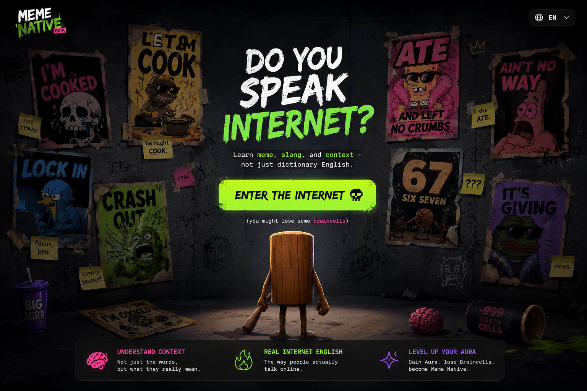

*Canonical landing direction: Dark Meme Shrine / Portal. This is a visual reference, not a pixel-perfect specification.*

## How to use this document

This file is the canonical source of truth for implementation. Keep it in the repository and give it to developers or coding assistants before they modify the project.

- If this file conflicts with an older chat, note, generated mockup, or unused upstream template behavior, this file takes precedence.
- Items marked **Frozen** should not be reopened unless implementation reveals a real blocker.
- Items marked **Tunable** can be adjusted during development without changing the product architecture.
- Do not add features that are listed as out of scope simply because they already exist in the upstream Duolingo clone.
- Learn and Search must share the same curated content source.
- AI is a fallback/discovery layer, not the core lesson engine. The core Learn flow must work without AI.
- Generated UI mockups define intent. Shared design tokens, shells, and component rules define the implementation.

> **Document status:** Product, system, content, UX architecture, visual direction, and technical reuse strategy are frozen for the prototype. Cosmetic details and balancing values remain tunable where explicitly stated.

## Notation

Plain-text flows use `->`. Mermaid diagrams keep native Mermaid arrow syntax such as `-->`. The document intentionally avoids decorative punctuation where normal technical prose is clearer.

# สารบัญ

- 1\. Executive Summary & Final Freeze

- 2\. Track Fit: Meme Design Engineering

- 3\. Problem, Target User & Value Proposition

- 4\. Product Principles

- 5\. MVP Scope, Priority & Out of Scope

- 6\. Content Model & Prototype Content v1.0

- 7\. Learning Model & Challenge System

- 8\. Information Architecture

- 9\. User Flows

- 10\. Gamification Specification

- 11\. Search, Dataset & AI Contract

- 12\. Data Model & Type Contracts

- 13\. Final UX/UI Specification

- 14\. Design System & UI Tokens

- 15\. Canonical Screen & Component Specification

- 16\. Technical Baseline: Upstream Repo

- 17\. Recommended Tech Stack

- 18\. System Architecture

- 19\. Selective Reuse Mapping

- 20\. Proposed Folder Structure

- 21\. State, Progress & Unlock Logic

- 22\. Search Implementation Detail

- 23\. AI / Multimodal Implementation Detail

- 24\. Security, Privacy & Content Integrity

- 25\. Testing & QA

- 26\. Implementation Plan (1-2 Days)

- 27\. Team Workstreams & Git Workflow

- 28\. Demo Script

- 29\. Definition of Done

- 30\. Frozen vs Tunable Decisions

- 31\. Risk Register & Cut Order

- 32\. Deployment & Handover

- 33\. License / Attribution

- Appendix A. Canonical UI Reference Gallery

- Appendix B. Mermaid Source Pack

- Appendix C. Sources & Verification

# 1. Executive Summary & Final Freeze

วอดส์ MEME คือแพลตฟอร์มเรียน “Internet English” ผ่าน Meme, Slang, Reaction และ Context โดยจุดเน้นไม่ใช่การท่องคำแปล แต่คือการอ่านบริบทให้เข้าใจว่าคนบนอินเทอร์เน็ตกำลังสื่ออะไร, tone เป็นแบบไหน และ expression เดียวกันเปลี่ยนความหมายอย่างไรเมื่อ structure/context เปลี่ยนไป.

> **One-line product statement:** "Duolingo สำหรับภาษาที่อินเทอร์เน็ตใช้จริง - เรียนจาก meme, slang และ context แทนการท่องคำแปล"

| **Decision Area**     | **Final Decision**                                                         |
|-----------------------|----------------------------------------------------------------------------|
| Product               | Meme-native Internet English Learning                                      |
| Core modes            | Learn + Search                                                             |
| Landing               | Dark Meme Shrine portal at /; shown every visit                            |
| Home                  | Home = Learn Path (/learn); no separate dashboard                          |
| Content               | Curated Learning Units; Learn and Search share one dataset                 |
| Learning interactions | MEME_CONTEXT, CONTRAST, USE_CASE                                           |
| Feedback              | Answer + Why + Context                                                     |
| Gamification          | Aura cumulative; Braincells humorous stat; Meme Rank derived from Aura     |
| Account               | No login for MVP; localStorage progress                                    |
| Search                | Dataset First -> AI Second                                                  |
| Screenshot search     | P2 stretch feature; UI can exist before backend is complete                |
| UX theme              | Landing dark; Main App light “Friendly Cursed Duolingo”                    |
| Technical strategy    | Selective reuse from sanidhyy/duolingo-clone, not a full backend migration |

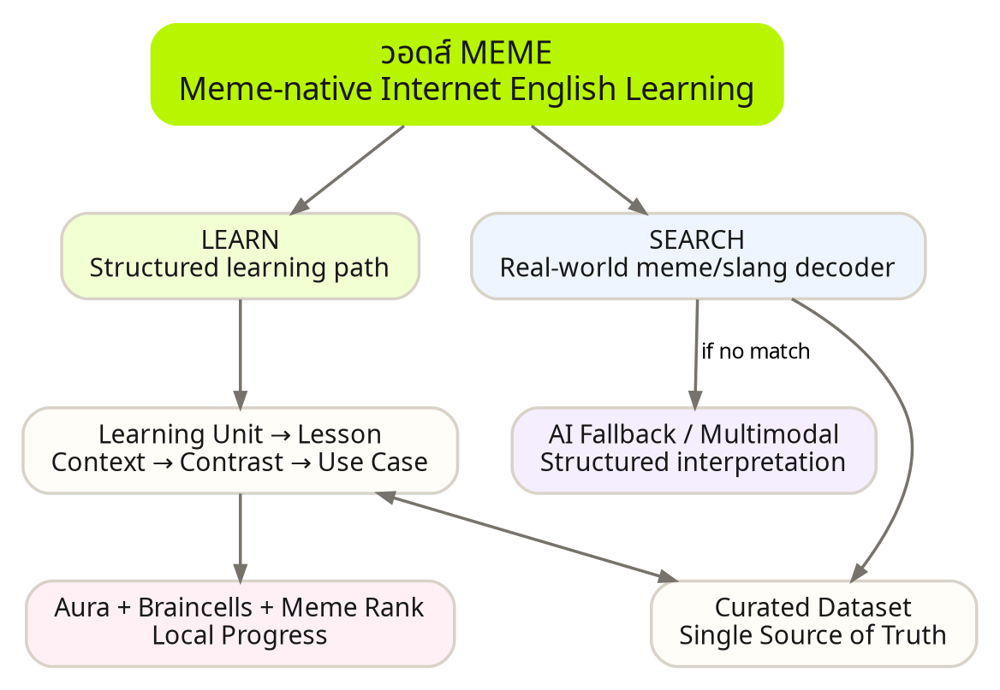

*Product architecture: Learn and Search share the same curated content source.*

# 2. Track Fit: Meme Design Engineering

โปรเจกต์นี้เข้ากับแนว Meme Design Engineering เพราะ “มีม” ไม่ได้ถูกใช้เป็นของตกแต่ง แต่ถูกออกแบบเป็น media/context layer เพื่อทำให้ข้อมูลภาษาอังกฤษที่ไม่ตรงตัวเข้าใจง่ายขึ้น และแปลงเป็น interactive learning experience ที่วัดความเข้าใจได้.

- **Information design:** ย่อย meaning, tone, context และ relation ของ expression ให้เป็น card/lesson ที่อ่านเร็ว.

- **Interactive learning:** ผู้ใช้ต้องตีความ meme/context ก่อนเห็นคำอธิบาย จึงไม่ใช่ passive meme dictionary.

- **New communication experience:** Search เชื่อมโลกจริงจาก social -> contextual explanation -> structured lesson.

- **Meme literacy:** Spotlight 67 แสดงให้เห็นว่าบาง meme ทำงานด้วย shared reference/timing มากกว่าคำแปลตรงตัว.

- **Design engineering:** ใช้ poster, sticker, gamification, state machine และ structured data เพื่อสร้างระบบที่ทำซ้ำ/ขยาย content ได้.

# 3. Problem, Target User & Value Proposition

## 3.1 Problem

- ผู้ใช้ “อ่านอังกฤษออก” แต่ไม่เข้าใจสิ่งที่ expression สื่อจริงใน social context.

- Dictionary/translation มักอธิบาย literal meaning แต่ไม่ตอบ tone, intent, culture หรือรูปประโยคที่เปลี่ยนความหมาย.

- Meme/slang เปลี่ยนเร็ว และ expression เดียวกันอาจมีหลาย sense.

- เครื่องมือ search/LLM ช่วยตอบได้ แต่ไม่ได้ออกแบบ learning loop เพื่อให้ผู้ใช้จำและแยก usage ได้ในครั้งต่อไป.

## 3.2 Target User

คนที่เล่น Social Media และเจอ English meme/slang/reaction อยู่เป็นประจำ แต่ไม่เข้าใจ context และอยาก “อิน” กับภาษาและ Internet Culture มากขึ้น ไม่จำกัดนักเรียนหรือมหาวิทยาลัย.

## 3.3 Jobs-to-be-Done

- เมื่อเห็น phrase/meme ที่ไม่เข้าใจ -> อยากรู้ให้เร็วว่าคนกำลังสื่ออะไร.

- เมื่อเรียน expression หนึ่ง -> อยากแยกคำที่ดูคล้ายแต่ความหมายต่างได้.

- เมื่อเจอสถานการณ์ใหม่ -> อยากเลือก expression ที่เหมาะสมได้.

- อยากรู้สึกว่าการเรียน internet English สนุกและมี character โดยไม่เสียความชัดเจน.

## 3.4 Value Proposition

> **Core transformation:** "อ่านออกแต่ไม่เก็ต" -> "เข้าใจ meaning + why + context และรู้ว่าจะใช้เมื่อไร"

# 4. Product Principles

1.  Context before definition: ให้ผู้ใช้เห็นสถานการณ์ก่อนคำแปล whenever possible.

2.  Curated learning, dynamic discovery: Lesson ต้องคงที่และผ่าน human review; Search fallback ใช้ AI ได้.

3.  Dataset First -> AI Second: AI ไม่ควรกลายเป็น product personality หรือ dependency ของ core learning.

4.  Chaotic personality, predictable UX: ความ cursed อยู่ที่ copy, poster, reaction, mascot; interaction ต้องชัด.

5.  Variable lesson length: 1 Learning Unit = 1 Lesson แต่ 2-5 challenges ตาม depth ของเนื้อหา.

6.  Search -> Learn bridge: Search ไม่จบที่คำตอบ ต้องชี้กลับ Learning Unit เมื่อมีความเกี่ยวข้อง.

7.  Demo-first engineering: COOK end-to-end สำคัญกว่าการทำ feature กว้างแต่ไม่จบ.

# 5. MVP Scope, Priority & Out of Scope

| **Priority**    | **Scope**                                                                                                              | **Exit Condition**                               |
|-----------------|------------------------------------------------------------------------------------------------------------------------|--------------------------------------------------|
| P0: Core       | Dark portal, Learn Path, COOK end-to-end, 3 challenge types, contextual feedback, Aura/Braincells/Rank, local progress | Core demo works without AI or DB                 |
| P1: Strong MVP | 5 core units, text search, curated dataset matching, Search -> Lesson                                                   | Known phrases return structured curated results  |
| P1.5            | AI text fallback                                                                                                       | Unknown text returns validated structured result |
| P2: Stretch    | Screenshot/image search with multimodal interpretation                                                                 | Image -> structured result -> related unit         |
| P3: Polish     | Animation, sound, extra mascot states, decorative assets                                                               | Only after functional flows are stable           |

**Out of scope (MVP):**

- AI tutor chat

- social network/friends

- leaderboard

- shop

- subscription/Stripe flow

- full account/auth system

- pronunciation AI

- air-writing/gesture input

- real-time trend tracking

- large vector database

- social scraping

- user-generated courses

- course marketplace

# 6. Content Model & Prototype Content v1.0

Entity กลางคือ LearningUnit แทนการบังคับทุกอย่างเป็น “Slang Family” เพื่อรองรับทั้ง slang, internet expression และ meme phrase.

| **Order** | **Unit**       | **Type**            | **Challenges** | **Learning Goal**                                    |
|-----------|----------------|---------------------|----------------|------------------------------------------------------|
| 01        | COOK / COOKED  | SLANG_FAMILY        | 5              | Structure + context can invert meaning               |
| 02        | LOCK IN        | INTERNET_EXPRESSION | 3              | Focus / commitment vs literal “lock”                 |
| 03        | CRASH OUT      | INTERNET_EXPRESSION | 4              | Emotional slang + tone                               |
| 04        | ATE            | SLANG_FAMILY        | 4              | Literal food vs strong praise                        |
| 05        | AIN’T NO WAY   | INTERNET_EXPRESSION | 3              | Disbelief / reaction / refusal                       |
| Spotlight | 67 / SIX SEVEN | MEME_PHRASE         | 3              | Recognition-based meme literacy; no fixed definition |

**Content guardrails:**

- Practice examples ต้องไม่แอบอ้างว่าเป็นโพสต์จริง.

- Lesson content เป็น curated/human-reviewed เท่านั้น.

- Search และ Learn ใช้ content source เดียวกัน.

- Challenge แต่ละข้อควรสอน insight ใหม่ ไม่ใช่เปลี่ยน wording แล้วถามซ้ำ.

- ไม่ยืดทุก Unit ให้ 5 ข้อ; ใช้จำนวน challenge เท่าที่ content ต้องการ.

- Media ใช้ original/licensed assets เป็นหลัก; หลีกเลี่ยง copyrighted franchise art ใน production.

- ระบุ informal register เมื่อจำเป็น และใส่ cultural origin เฉพาะที่ช่วยความเข้าใจ ไม่เปลี่ยน lesson เป็น lecture.

# 7. Learning Model & Challenge System

> **Learning loop:** Encounter -> Guess from Context -> Explanation -> Compare/Contrast -> Use in Context -> Complete

| **Challenge Type** | **What user sees**                          | **What it measures**           | **Canonical UI**                             |
|--------------------|---------------------------------------------|--------------------------------|----------------------------------------------|
| MEME_CONTEXT       | Meme/clip/social context + 3 choices        | Context interpretation         | Media/context card -> question -> answer cards |
| CONTRAST           | Two near-identical expressions side-by-side | Nuance / structure distinction | Large card VS card comparison                |
| USE_CASE           | Situation/chat + candidate responses        | Pragmatic usage                | Context card -> response choices              |

**Feedback contract:**

> Feedback = Reaction Headline  
> + Reward (Aura / Braincells)  
> + ANSWER  
> + WHY  
> + CONTEXT  
> + Continue / Try Again

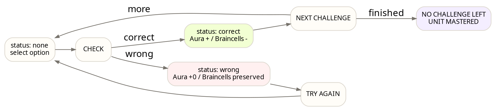

*Lesson state machine: preserve upstream selection/status/next pattern while replacing server-side hearts/progress logic.*

# 8. Information Architecture

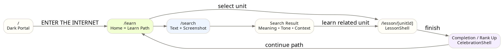

*Final MVP information architecture.*

> flowchart LR  
> A\["/ Dark Portal"\] --\>\|ENTER THE INTERNET\| B\["/learn Home = Learn Path"\]  
> B --\> C\["/lesson/\[unitId\] LessonShell"\]  
> C --\> D\["Completion / Rank Up"\]  
> D --\> B  
> B --\> E\["/search Text + Screenshot"\]  
> E --\> F\["Structured Search Result"\]  
> F --\>\|Learn related unit\| C

**Routing contract:**

| **Route**          | **Role**                                            | **Shell**           |
|--------------------|-----------------------------------------------------|---------------------|
| /                  | Portal; product first impression; shown every visit | Portal shell (dark) |
| /learn             | Home + sequential learning path                     | AppShell (light)    |
| /lesson/\[unitId\] | All challenge types and feedback states             | LessonShell (light) |
| /search            | Text search and optional screenshot upload          | AppShell (light)    |
| /api/interpret     | Server-side AI fallback endpoint; no UI             | Route handler       |

# 9. User Flows

## 9.1 Learning Flow (P0)

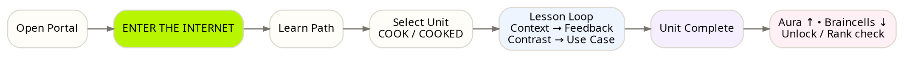

*Core learning flow. This is the hackathon’s most important end-to-end path.*

> flowchart TD  
> A\[Open Portal\] --\> B\[ENTER THE INTERNET\]  
> B --\> C\[Learn Path\]  
> C --\> D\[Select COOK / COOKED\]  
> D --\> E\[MEME_CONTEXT\]  
> E --\> F\[Answer + Why + Context\]  
> F --\> G\[CONTRAST\]  
> G --\> H\[USE_CASE\]  
> H --\> I\[Unit Complete\]  
> I --\> J\[Aura up / Braincells down / Rank check\]  
> J --\> C

## 9.2 Search Flow (P1/P2)

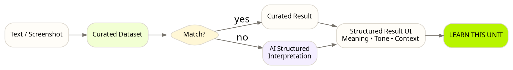

*Search uses curated dataset first, then AI only as fallback.*

> flowchart TD  
> Q\[Text or Screenshot\] --\> N\[Normalize / detect phrase + context\]  
> N --\> D\[Search Curated Dataset\]  
> D --\> M{Match?}  
> M --\>\|Yes\| C\[Curated Result\]  
> M --\>\|No\| A\[AI Structured Interpretation\]  
> A --\> R\[Find closest Learning Unit\]  
> C --\> U\[Same Structured Result UI\]  
> R --\> U  
> U --\> L\[LEARN THIS UNIT\]

# 10. Gamification Specification

| **Mechanic** | **Frozen Behavior**                                                           | **Tunable Values**                 |
|--------------|-------------------------------------------------------------------------------|------------------------------------|
| Aura         | Cumulative progression score; correct answers/unit completion increase Aura   | Reward amount, rank thresholds     |
| Braincells   | Fictional humorous stat; correct answers reduce it; wrong answers preserve it | Exact deduction per challenge/tier |
| Meme Rank    | Derived from Aura; never stored as independent truth                          | Names + thresholds                 |
| Unlock       | Sequential core path; complete previous unit to unlock next                   | Debug flag can unlock all for demo |

> Initial Aura: 0  
> Initial Braincells: 86_000_000_000  
>   
> Easy correct: +2 Aura  
> Normal correct: +3 Aura  
> Hard / Contrast: +4 Aura  
> Unit complete: +5 Aura  
> Wrong: +0 Aura; Braincells preserved  
>   
> // Braincell deductions are configurable tiers, not hard-coded content facts.

Display rule: header ใช้ compact form เช่น 83.4B Braincells; Home/detail/reward moment สามารถใช้ full dramatic number. ไม่ใช้ XP ใน UI: rank progress ต้องอิง Aura เท่านั้น.

# 11. Search, Dataset & AI Contract

Search ต้องทำหน้าที่เป็น cultural-language decoder ไม่ใช่ chatbot. ทั้ง curated result และ AI result render ผ่านโครงสร้าง component เดียวกัน โดยแสดง source badge เช่น CURATED หรือ AI INTERPRETATION.

| **Result Field** | **Required** | **Notes**                                 |
|------------------|--------------|-------------------------------------------|
| detectedPhrase   | Yes          | Canonical phrase/expression               |
| meaningTH        | Yes          | Concise Thai meaning                      |
| meaningEN        | Yes          | Concise English paraphrase                |
| tone\[\]         | Yes          | e.g. informal, humorous, mocking          |
| context          | Yes          | Why this meaning fits this situation      |
| relatedUnitId    | Optional     | Only if a useful curated unit exists      |
| confidence       | AI only      | 0-1 internal confidence; UI may hide it   |
| detectedText     | Image only   | Text extracted/recognized from screenshot |
| visualContext    | Image only   | Relevant non-text visual cues; concise    |

> **Critical rule:** AI must return structured fields. The frontend must not depend on an unconstrained AI paragraph. AI must never generate a new live lesson; lessons remain curated.

# 12. Data Model & Type Contracts

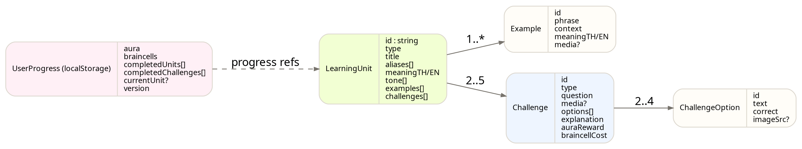

*Hackathon data model: static curated content + local user progress.*

> type LearningUnitType =  
> \| "SLANG_FAMILY"  
> \| "INTERNET_EXPRESSION"  
> \| "MEME_PHRASE";  
>   
> type ChallengeType =  
> \| "MEME_CONTEXT"  
> \| "CONTRAST"  
> \| "USE_CASE";  
>   
> type LearningUnit = {  
> id: string;  
> type: LearningUnitType;  
> title: string;  
> subtitle: string;  
> meaningTH?: string;  
> meaningEN?: string;  
> tone: string\[\];  
> aliases: string\[\];  
> variants?: string\[\];  
> examples: Example\[\];  
> challenges: Challenge\[\];  
> order: number;  
> spotlight?: boolean;  
> };  
>   
> type Challenge = {  
> id: string;  
> type: ChallengeType;  
> question: string;  
> media?: { type: "IMAGE" \| "VIDEO" \| "GIF"; src: string };  
> options: ChallengeOption\[\];  
> explanation: {  
> answer: string;  
> why: string;  
> context: string;  
> th?: string;  
> en?: string;  
> };  
> auraReward: number;  
> braincellCost: number;  
> };
>
> type ProgressState = {  
> version: 1;  
> aura: number;  
> braincells: number;  
> completedUnits: string\[\];  
> completedChallenges: string\[\];  
> currentUnit?: string;  
> debugUnlockAll?: boolean;  
> };  
>   
> // Rank is derived:  
> getMemeRank(progress.aura)

# 13. Final UX/UI Specification

> **Final visual concept:** Landing = Dark Meme Shrine. Main App = Light Friendly Cursed Duolingo. Poster/paper/sticker language connects both worlds.

| **Area**    | **Final Rule**                                                                          |
|-------------|-----------------------------------------------------------------------------------------|
| Platform    | Desktop-first, canonical 1440x900 / 16:10 reference; responsive later                   |
| Landing     | Dark concrete poster shrine, Tung Tung back view, clear “ENTER THE INTERNET” CTA        |
| Main App    | Warm ivory/light theme, paper surfaces, readable high-contrast text                     |
| Home        | Home = Learn Path; no separate dashboard                                                |
| Navigation  | Logo/Home + Learn + Search only                                                         |
| Poster      | Core visual metaphor: landing decoration -> unit card -> spotlight -> mastered collectible |
| Mascot      | Emotional guide only: landing, feedback, completion, rank-up; not on every screen       |
| Lesson      | Cleanest screen; context and answers dominate, decorative density low                   |
| Search      | Structured tool; no AI chat bubbles                                                     |
| Feedback    | Meme energy returns, but explanation remains readable                                   |
| Consistency | Final Spec/shared tokens beat individual generated mockups when they conflict           |

## 13.1 Three canonical shells

> AppShell  
> |- Sidebar (Logo / Learn / Search)  
> |- Main content  
> Used by: Learn, Search, Search Result  
>   
> LessonShell  
> |- Close  
> |- Progress  
> |- Aura / Braincells  
> |- ChallengeRenderer  
> |- FeedbackPanel  
> Used by: Meme Context, Contrast, Use Case, Correct/Wrong  
>   
> CelebrationShell  
> |- Reward / collectible poster  
> |- Mascot moment  
> |- CTA  
> Used by: Lesson Complete, Rank Up

# 14. Design System & UI Tokens

| **Token**  | **Recommended v1 Value** | **Role**                     |
|------------|--------------------------|------------------------------|
| background | \#F8F4EC                 | Main light app background    |
| surface    | \#FFFDF8                 | Cards / paper surfaces       |
| ink        | \#171717                 | Primary text                 |
| muted      | \#77736C                 | Secondary text               |
| lime       | \#B8F500                 | Primary CTA, active, correct |
| pink       | \#F43F8F                 | Braincells / meme emphasis   |
| purple     | \#7447F5                 | Aura / rank                  |
| blue       | \#2984F2                 | Information accents          |
| orange     | \#FF6B35                 | Wrong/warning                |
| border     | \#DDD8CF                 | Neutral UI borders           |

**Typography:**

- **Display role:** bold/condensed expressive type for poster titles, RANK UP, reaction headlines. Practical candidate: Anton/Bebas-style; final font can change.

- **UI role:** Inter-like Latin UI font paired with Noto Sans Thai for Thai body text. Body/explanation must prioritize legibility.

- **Rule:** Do not use distressed/display typography for long explanations or search results.

**Geometry / spacing:**

- Desktop baseline: 1440x900.

- Sidebar target: 230-250px (canonical 240px).

- Main content max width: ~1180px.

- Lesson content: ~760-840px for reading-heavy blocks; challenge visuals may widen to ~1050px.

- Spacing scale: 8 / 16 / 24 / 32 / 48 / 64.

- UI card radius: ~14-16px; poster edges may be irregular but clickable hit-area remains conventional.

**Decorative density:**

- Home/Search: ~15-20% decorative

- Lesson: ~5-10% decorative

- Feedback: ~15% decorative

- Completion/Rank: ~25-30% decorative

# 15. Canonical Screen & Component Specification

| **Screen**    | **Canonical Reference**               | **Implementation Contract**                                                                            |
|---------------|---------------------------------------|--------------------------------------------------------------------------------------------------------|
| Landing       | Selected dark portal                  | Dark only; CTA obvious within 1 second; posters secondary; mascot 30-40% hero height                   |
| Home / Learn  | Internet English 101 mockup           | AppShell; poster-unit path; right stats panel; 67 Spotlight                                            |
| Meme Context  | bro is cooked · 1/5                   | LessonShell; context card hero; 3 answer cards; CHECK                                                  |
| Contrast      | WHICH ONE IS PRAISE?                  | Same LessonShell; 2 large side-by-side cards + VS                                                      |
| Use Case      | FRIEND: I just nailed my presentation | Same LessonShell; social context + response cards                                                      |
| Correct       | HE COOKED                             | FeedbackPanel contract: headline + reward + Answer/Why/Context                                         |
| Wrong         | BRO READ THE ROOM                     | Same FeedbackPanel; supportive retry; Braincells preserved                                             |
| Completion    | MASTERED                              | CelebrationShell; collectible poster + rewards + CONTINUE PATH                                         |
| Search        | WHAT DID BRO MEAN?                    | AppShell; text input + optional screenshot dropzone                                                    |
| Search Result | BRO IS COOKED                         | Structured sections, source badge, related expressions, Learn Unit CTA; remove SAVE unless implemented |
| Rank Up       | NORMIE -> ONLINE                       | CelebrationShell; Aura-derived transition                                                              |

**Component inventory:**

> AppShell  
> Sidebar  
> BrandLogo  
> StatPill  
> LearningPath  
> LearningUnitCard  
> SpotlightCard  
>   
> LessonShell  
> LessonProgress  
> ChallengeRenderer  
> |- MemeContextChallenge  
> |- ContrastChallenge  
> |- UseCaseChallenge  
> AnswerCard  
> FeedbackPanel  
> RewardRow  
> ExplanationRow  
>   
> SearchBox  
> ScreenshotDropzone  
> InterpretationResult  
> RelatedExpressionCard  
>   
> CompletionPoster  
> RankBadge

# 16. Technical Baseline: Upstream Repo

Reference repository: sanidhyy/duolingo-clone. The repository was verified from GitHub on 16 Aug 2026. Its current root contains app/, actions/, components/, db/, store/, and lesson components; the README describes a full-stack language-learning clone, while package.json currently pins Next 16.2.11, React 19.2.8, TypeScript 6, Tailwind CSS 3.4.19, Zustand 5.0.14, Drizzle 0.45.2, Clerk 7.5.22, Neon client, Stripe and React Admin. [G1][G2]

| **Upstream Area** | **Observed in current repo**                                                   | **Our decision**                                                                                      |
|-------------------|--------------------------------------------------------------------------------|-------------------------------------------------------------------------------------------------------|
| Framework         | Next.js App Router + React + TypeScript                                        | Keep                                                                                                  |
| Styling/UI        | Tailwind + Radix packages + utility libraries                                  | Keep/restyle                                                                                          |
| State             | Zustand used for modal stores                                                  | Keep; extend for local progress                                                                       |
| Content DB        | Drizzle + Neon/Postgres schema                                                 | Do not depend on for hackathon content                                                                |
| Auth              | Clerk                                                                          | Bypass for MVP                                                                                        |
| Payments          | Stripe                                                                         | Do not use                                                                                            |
| Admin             | React Admin                                                                    | Do not use                                                                                            |
| Lesson            | app/lesson includes quiz.tsx, challenge.tsx, header/footer/result-card         | Reuse/refactor state machine and layout patterns                                                      |
| Schema            | courses -> units -> lessons -> challenges -> options; challenge type SELECT/ASSIST | Use as reference; replace with static LearningUnit model for prototype                                |
| Gamification      | Hearts + points                                                                | Replace with Aura + Braincells                                                                        |
| License           | MIT                                                                            | Reuse allowed subject to license notice; hackathon eligibility rules must still be checked separately |

Upstream quiz.tsx is especially valuable: it already contains activeIndex, selectedOption, status none/wrong/correct, percentage, onSelect/onContinue/onNext, audio, confetti and completion flow. However it currently calls server actions for challenge progress and hearts, so those calls should be replaced by local progress logic. [G4]

# 17. Recommended Tech Stack

| **Layer**             | **Recommended**                                             | **Why**                                                               |
|-----------------------|-------------------------------------------------------------|-----------------------------------------------------------------------|
| Package manager       | pnpm (upstream packageManager: 11.11.0)                     | Minimize changes from repo                                            |
| Framework             | Next.js 16 (retain repo version initially)                  | App Router + route handlers + reuse upstream components               |
| UI runtime            | React 19                                                    | Keep upstream compatibility                                           |
| Language              | TypeScript 6                                                | Typed content/AI contracts                                            |
| Styling               | Tailwind CSS 3.4.x                                          | Upstream already configured; fastest restyle                          |
| Accessible primitives | Existing Radix UI packages                                  | Reuse dialogs/progress/slot if needed                                 |
| Icons                 | lucide-react                                                | Already installed                                                     |
| State                 | Zustand + persist/localStorage                              | No-login progress; simple hackathon state                             |
| Content               | Static TypeScript: data/learning-units.ts                   | Human-reviewable, no DB dependency                                    |
| Search                | Custom normalize/score function                             | No vector DB; deterministic and fast                                  |
| AI client             | Server-side AI adapter; recommended OpenAI official SDK     | Text + image interpretation; keep provider behind interface           |
| AI API pattern        | Responses API + image input + JSON Schema structured output | Supports multimodal input and schema-constrained results [O1][O2] |
| Feedback/polish       | sonner, react-confetti, react-use (existing)                | Reuse only where useful                                               |
| Deployment            | Vercel or equivalent Next-compatible host                   | Lowest friction for demo                                              |

> **Stack constraint:** Do not upgrade or replatform during the hackathon unless the cloned baseline fails. Preserve the upstream dependency set first; add only what is necessary for Search/AI.

# 18. System Architecture

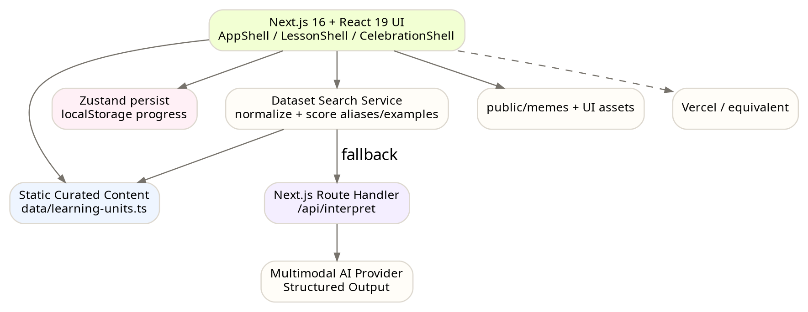

*Recommended prototype architecture: no mandatory DB or auth path.*

> flowchart TD  
> UI\[Next.js + React UI\] --\> DATA\[data/learning-units.ts\]  
> UI --\> STORE\[Zustand persist / localStorage\]  
> UI --\> SEARCH\[Dataset Search Service\]  
> SEARCH --\> DATA  
> SEARCH --\>\|no match\| API\[/api/interpret\]  
> API --\> AI\[Multimodal AI Provider\]  
> UI --\> ASSETS\[public/memes + UI assets\]

# 19. Selective Reuse Mapping

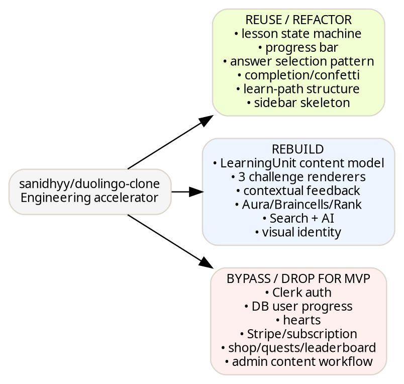

*Selective reuse strategy: generic learning mechanics stay; product identity is rebuilt.*

| **Repo Item / Pattern**        | **Action**                                   | **Target**                                           |
|--------------------------------|----------------------------------------------|------------------------------------------------------|
| app/lesson/quiz.tsx            | Reuse logic + refactor                       | MemeLessonEngine / LessonShell                       |
| app/lesson/challenge.tsx       | Reuse selection/status pattern               | ChallengeRenderer + specialized challenge components |
| lesson header/footer/progress  | Reuse then restyle                           | Shared LessonShell                                   |
| completion/confetti            | Reuse behavior, replace content              | Completion / Rank moment                             |
| learn path components          | Reuse structural idea/layout where efficient | Poster-based LearningPath                            |
| sidebar                        | Reuse skeleton only                          | Logo + Learn + Search                                |
| db/schema.ts                   | Reference only                               | Static LearningUnit types                            |
| db/queries.ts / actions        | Bypass                                       | No DB progress in MVP                                |
| Clerk middleware/auth          | Bypass/remove from active flow               | Open app immediately                                 |
| hearts logic                   | Remove from lesson flow                      | Braincells is not lives                              |
| Stripe/shop/quests/leaderboard | Hide/do not use                              | Out of scope                                         |

# 20. Proposed Folder Structure

> app/  
> |-- page.tsx \# Dark Portal  
> |-- (main)/  
> | |-- layout.tsx \# AppShell  
> | |-- learn/page.tsx \# Home = Learn Path  
> | |-- search/page.tsx  
> |-- lesson/  
> | |-- \[unitId\]/page.tsx  
> |-- api/  
> |-- interpret/route.ts \# P1.5/P2  
>   
> components/  
> |-- app-shell/  
> |-- learn/  
> | |-- learning-path.tsx  
> | |-- learning-unit-card.tsx  
> | |-- spotlight-card.tsx  
> |-- lesson/  
> | |-- lesson-shell.tsx  
> | |-- challenge-renderer.tsx  
> | |-- meme-context.tsx  
> | |-- contrast.tsx  
> | |-- use-case.tsx  
> | |-- feedback-panel.tsx  
> |-- search/  
> | |-- search-box.tsx  
> | |-- screenshot-dropzone.tsx  
> | |-- interpretation-result.tsx  
> |-- progress/  
> |-- aura.tsx  
> |-- braincells.tsx  
> |-- meme-rank.tsx  
>   
> data/  
> |-- learning-units.ts  
>   
> lib/  
> |-- search/  
> | |-- normalize.ts  
> | |-- search-dataset.ts  
> |-- ai/  
> |-- types.ts  
> |-- schema.ts  
> |-- provider.ts  
>   
> store/  
> |-- progress-store.ts  
>   
> public/  
> |-- memes/  
> |-- assets/

Do not spend the first hours deleting unused upstream folders. Hide/bypass unused routes first; remove later only if they create build/auth blockers.

# 21. State, Progress & Unlock Logic

Use Zustand persist to localStorage. Keep content immutable and progress separate. Include a storage version so state can be reset/migrated safely during rapid iteration.

> const INITIAL_PROGRESS = {  
> version: 1,  
> aura: 0,  
> braincells: 86_000_000_000,  
> completedUnits: \[\],  
> completedChallenges: \[\],  
> debugUnlockAll: false,  
> };  
>   
> isUnitUnlocked(unitIndex) =  
> debugUnlockAll \|\|  
> unitIndex === 0 \|\|  
> completedUnits.includes(units\[unitIndex - 1\].id);  
>   
> completeCorrectChallenge(challenge) {  
> addAura(challenge.auraReward);  
> loseBraincells(challenge.braincellCost);  
> completeChallenge(challenge.id);  
> }  
>   
> onWrong() {  
> // no Aura, no Braincell loss  
> // show feedback and allow retry  
> }

> **Demo safety:** Add a non-prominent debug/dev flag to unlock all units or reset progress. Do not expose this as a normal user feature in the judged demo unless needed.

# 22. Search Implementation Detail

P1 search should be deterministic enough to work without AI. No vector database is needed.

> normalize(query):  
> lowercase  
> trim  
> collapse whitespace  
> normalize apostrophes  
> remove non-semantic punctuation where safe  
>   
> score(query, unit):  
> exact title/alias match = 100  
> exact normalized variant = 95  
> alias contains query = 80  
> query contains alias = 75  
> example phrase overlap = 60  
> token overlap / simple fuzzy = 40..59  
>   
> if score \>= threshold:  
> return CURATED result  
> else:  
> call AI fallback (if enabled)

Search result UI must include Meaning, English paraphrase, Tone, Why/Context, Related expressions and Learn related unit. “SAVE THIS” is excluded until a save/favorite feature is explicitly implemented.

# 23. AI / Multimodal Implementation Detail

Recommended provider interface is intentionally small so the app is not coupled to a particular model. For OpenAI, the official Responses API supports text and image inputs, and Structured Outputs can constrain model output to a JSON Schema. [O1][O2]

> type Interpretation = {  
> source: "AI";  
> detectedPhrase: string;  
> meaningTH: string;  
> meaningEN: string;  
> tone: string\[\];  
> context: string;  
> relatedUnitId: string \| null;  
> confidence: number;  
> detectedText?: string; // image only  
> visualContext?: string; // image only  
> };

**Server route behavior:**

8.  Validate input size/type.

9.  Build concise interpretation prompt + JSON schema.

10. Call provider server-side; API key never reaches client.

11. Parse/validate result against schema.

12. Run related-unit matcher over detectedPhrase/aliases.

13. Return structured payload only.

14. UI renders AI result with “AI INTERPRETATION” badge.

**Failure behavior:**

- If AI unavailable -> show “Couldn’t interpret this yet” without affecting Learn.

- If AI confidence low -> do not invent a related lesson; relatedUnitId = null.

- If screenshot upload is not ready by demo time -> disable dropzone or mark it “Coming in prototype”; do not fake a working AI flow.

# 24. Security, Privacy & Content Integrity

- **Secrets:** AI/API keys must live only in server environment variables; never NEXT_PUBLIC\_\*.

- **Screenshots:** Do not claim “not stored” unless the actual provider/application retention configuration guarantees it. OpenAI documentation notes application-state retention behavior for Responses; treat privacy copy as an implementation decision, not a decorative promise. [O1][O3]

- **Uploads:** Validate MIME type and size; reject unsupported data.

- **Curated lessons:** AI may help author drafts offline, but production lesson data is human-reviewed and version-controlled.

- **Generated examples:** Clearly treat mock/social examples as educational examples, not real posts.

- **Copyright:** Use original/licensed meme-learning art for production whenever practical.

- **No health claim:** Braincells is a fictional humorous stat, not biological/medical measurement.

# 25. Testing & QA

For a 1-2 day hackathon, prioritize build/smoke/integration checks over adding a large test framework mid-project.

| **Check**                        | **Required**                                                   |
|----------------------------------|----------------------------------------------------------------|
| pnpm lint / existing lint script | Pass or known non-blocking issues documented                   |
| pnpm build                       | Pass before final demo                                         |
| Portal -> Learn                   | Works on fresh load                                            |
| Sequential unlock                | COOK available; next unlocks after completion                  |
| Refresh persistence              | Aura/Braincells/completion survive refresh                     |
| Wrong answer                     | Does not consume Braincells; retry works                       |
| Correct answer                   | Rewards once; no duplicate reward on repeated Continue         |
| All 3 challenge renderers        | Render/select/check/feedback/next                              |
| Search known phrase              | Returns curated COOK result                                    |
| Search unknown phrase            | Graceful fallback; AI if enabled                               |
| Search -> Learn                   | Related Unit CTA routes correctly                              |
| No XP/hearts leakage             | Old terms absent from active UI                                |
| No auth blocker                  | User can enter prototype without account                       |
| Responsive minimum               | Desktop judged size works; no clipping at 1280x720 if possible |
| Accessibility basics             | Keyboard focus visible; buttons semantic; contrast readable    |

# 26. Implementation Plan (1-2 Days)

| **Phase**           | **Work**                                                               | **Milestone / Stop Rule**                        |
|---------------------|------------------------------------------------------------------------|--------------------------------------------------|
| 0: Baseline        | Clone repo; pnpm install; run; capture working commit                  | Do not modify architecture before baseline boots |
| 1: Strip blockers  | Bypass Clerk-dependent active routes; reduce sidebar; route / -> portal | App opens without login                          |
| 2: Content source  | Create LearningUnit types + COOK data                                  | Static COOK data renders                         |
| 3: Progress        | Zustand persist; Aura/Braincells; unlock helper                        | Refresh keeps state                              |
| 4: Hero lesson     | Refactor quiz state machine; implement COOK end-to-end                 | P0 product exists: protect this milestone       |
| 5: Challenge types | MemeContext, Contrast, UseCase                                         | 3 renderers share one shell                      |
| 6: Learn Path      | Poster unit cards + states + 67 spotlight                              | Sequential unlock visible                        |
| 7: Search P1       | Dataset search + structured result                                     | Known query works                                |
| 8: Content fill    | Add LOCK IN, CRASH OUT, ATE, AIN’T NO WAY, 67                          | 5+1 content set usable                           |
| 9: AI P1.5         | Text fallback behind /api/interpret                                    | Only if stable                                   |
| 10: Image P2       | Screenshot input + multimodal                                          | Cut first if time pressure                       |
| 11: Polish         | Correct/wrong animation, completion/rank, assets, sound                | Do not jeopardize build/demo                     |

> **Critical milestone:** Once COOK works from Learn Path -> 3 challenge types -> feedback -> complete -> progress, stop expanding architecture. Everything after that is incremental.

# 27. Team Workstreams & Git Workflow

Split by workstream rather than by page to minimize merge conflict:

- **Core/lesson:** quiz state machine, progress store, challenge renderer, completion.

- **Content/UI:** LearningUnit dataset, Learn Path cards, styling/tokens, canonical screen normalization.

- **Search/AI:** dataset matcher, search result, optional API route/image input.

- **Assets/polish:** media, mascot/poster assets, transitions, sound after core freeze.

**Recommended branch pattern:**

> main \# always demo-able  
> feat/core-lesson  
> feat/learn-path  
> feat/search  
> feat/ai-fallback  
> chore/assets  
>   
> Commit in small vertical slices. Merge P0 changes early and frequently.  
> Before risky refactor: create a checkpoint tag/branch.

# 28. Demo Script

15. Open / -> Dark Meme Shrine. One sentence: “This teaches the English the internet actually uses.”

16. Click ENTER THE INTERNET -> Learn Path. Point to Aura, Braincells, Meme Rank and 67 Spotlight.

17. Open COOK / COOKED.

18. Meme Context: “bro is cooked 💀” -> choose meaning -> show Answer + Why + Context.

19. Contrast: “He cooked.” vs “He’s cooked.” -> demonstrate structure changing meaning.

20. Use Case: friend nailed presentation -> “He cooked 🔥”.

21. Complete unit -> show Aura increase, Braincells loss and MASTERED collectible.

22. Open Search -> paste “bro is cooked 💀” -> show curated result and related expressions.

23. Click LEARN COOK / COOKED -> prove Search and Learn are connected.

24. If P2 is stable, finish with screenshot interpretation; otherwise do not risk the demo.

> **Presentation framing:** The innovation is not "AI explains slang." It is the engineered loop that turns context-heavy internet language into structured, interactive, reusable learning, with Search bridging real-world encounters back into curriculum.

# 29. Definition of Done

**P0 Done when ALL are true:**

- Portal exists and enters /learn.

- Learn Path shows the frozen content set structure and sequential state.

- COOK lesson is playable end-to-end.

- All three challenge types work under one LessonShell.

- Correct and wrong feedback teach Answer + Why + Context.

- Aura and Braincells update correctly and persist.

- Rank derives from Aura.

- Completion returns to Learn Path and unlocks next unit.

- No mandatory auth/database/subscription dependency remains in the active demo flow.

**P1 Done when:**

- Text search matches curated aliases/examples.

- Structured result page works.

- Search -> related lesson works.

**P2 Done when:**

- Screenshot/image can be submitted safely.

- Multimodal result conforms to schema.

- Result maps to curated unit when appropriate.

# 30. Frozen vs Tunable Decisions

| **Frozen: do not reopen without blocker** | **Tunable: may change during implementation**     |
|--------------------------------------------|----------------------------------------------------|
| Product concept / target / Learn+Search    | Exact wording/copy                                 |
| LearningUnit model + variable length       | Exact challenge ordering                           |
| 3 challenge types                          | Question examples/media                            |
| Answer + Why + Context feedback            | Feedback meme copy                                 |
| Dataset-first / AI-second                  | AI model/provider                                  |
| Curated lesson rule                        | Search matching threshold                          |
| No login MVP                               | Exact localStorage shape/versioning details        |
| Aura/Braincells mechanics                  | Reward/deduction values                            |
| Rank derived from Aura                     | Rank names/thresholds                              |
| Landing dark / Main app light              | Exact HEX/font/shadows                             |
| Home = Learn Path                          | Poster artwork/details                             |
| Sequential unlock                          | Debug unlock mechanism                             |
| Selective repo reuse strategy              | How much CSS/component code is copied vs rewritten |

# 31. Risk Register & Cut Order

| **Risk**                                 | **Impact** | **Mitigation / Cut**                                            |
|------------------------------------------|------------|-----------------------------------------------------------------|
| Clerk/DB coupling blocks routes          | High       | Bypass active auth/query paths early; static data + local store |
| Trying to preserve full upstream backend | High       | Do not migrate DB schema for MVP                                |
| AI latency/failure                       | Medium     | Learn works offline from AI; dataset-first search               |
| Screenshot feature consumes time         | Medium     | P2; cut before text search/core lesson                          |
| Generated UI references conflict         | Medium     | Final shared tokens + three shells are source of truth          |
| Asset consistency                        | Low/Medium | Use placeholders; production asset pack after core              |
| Content accuracy                         | High       | Curated/human-reviewed dataset; source notes                    |
| Too much visual decoration               | Medium     | Keep lesson decorative density lowest                           |
| Build breaks near demo                   | High       | Keep main demo-able; build before polish; stop risky refactors  |

**Cut order under time pressure (first -> last):**

> Image Search -> AI Text Fallback -> extra animations/sounds -> non-COOK polish -> extra asset fidelity  
> NEVER cut: COOK core lesson, contextual feedback, progress, Learn Path, text dataset search if P1 is promised.

# 32. Deployment & Handover

- Deploy on Vercel or another host compatible with the repo’s Next.js version.

- Set server-only AI environment variables in deployment dashboard; do not commit .env.

- Keep demo dataset in repository for deterministic judging.

- Provide reset-progress option for presenters (query flag/dev control/localStorage clear).

- Record a short fallback demo video if contest rules allow, but live flow remains primary.

- Before handover: pnpm install -> lint -> build -> smoke-test fresh browser/localStorage.

# 33. License / Attribution

The upstream sanidhyy/duolingo-clone repository declares the MIT License. The license permits use, copy, modification, merge, publication and distribution provided the copyright and permission notice are retained in copies or substantial portions. [G5]

- Keep the upstream LICENSE file if substantial code is reused.

- Add an acknowledgements note identifying the upstream repository and author.

- MIT permission does not automatically answer hackathon eligibility; check event rules separately for pre-existing/open-source template use.

- Do not reuse copyrighted Duolingo/franchise visual assets as the identity of วอดส์ MEME; use original product visuals/media.

# Appendix A. Canonical UI Reference Gallery

Generated mockups are visual references, not pixel-perfect specifications. Shared tokens and canonical shells in this document take precedence when mockups disagree.

## Landing / Portal: Dark Meme Shrine

## Home / Learn Path: AppShell baseline

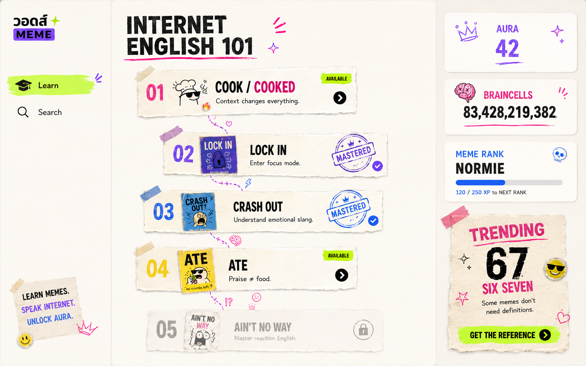

## Meme Context: LessonShell baseline

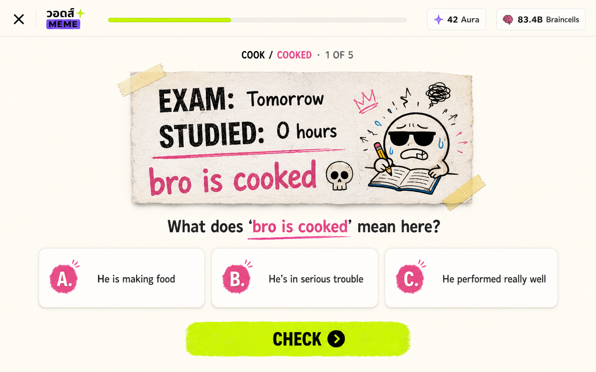

## Contrast Challenge

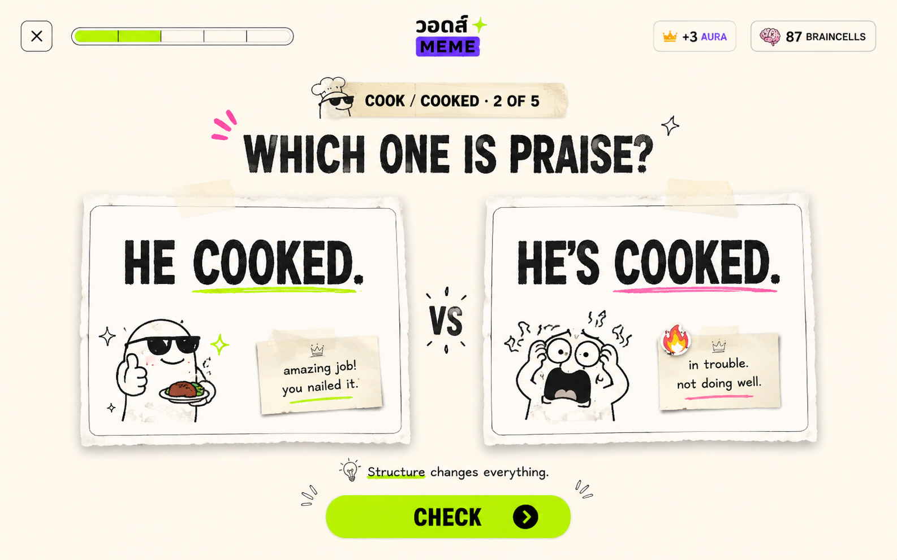

## Use Case Challenge

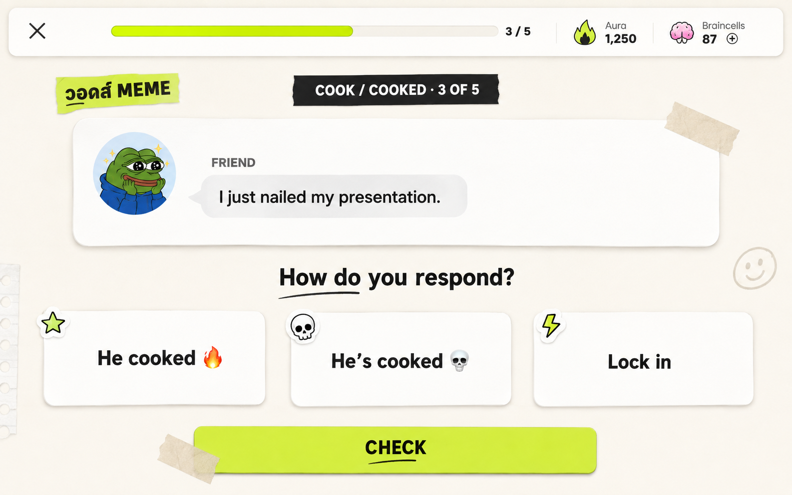

## Correct Feedback: Answer / Why / Context

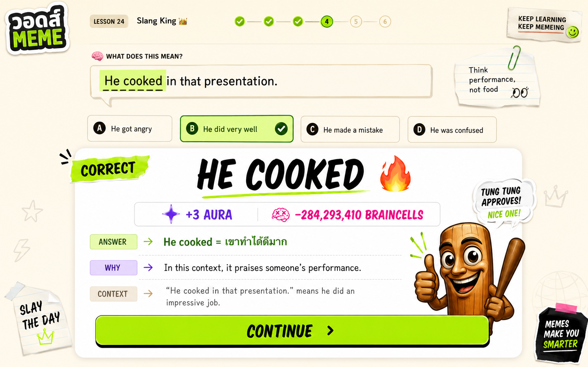

## Wrong Feedback

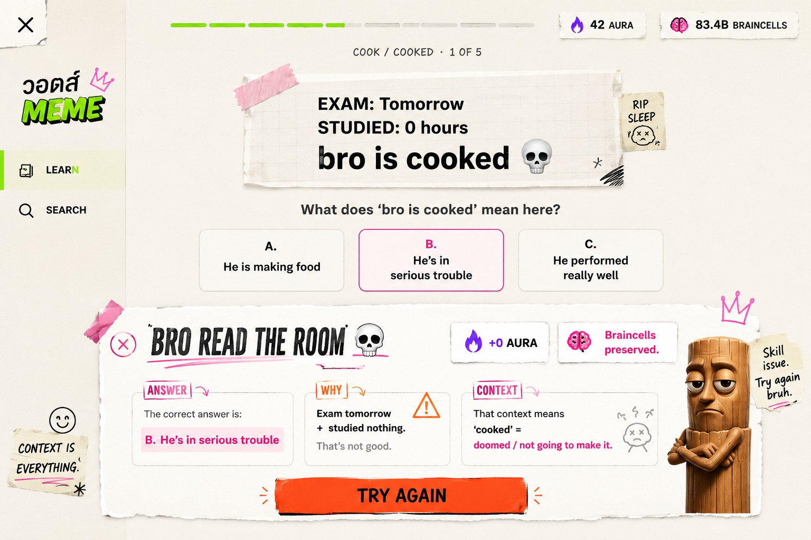

## Lesson Complete / MASTERED

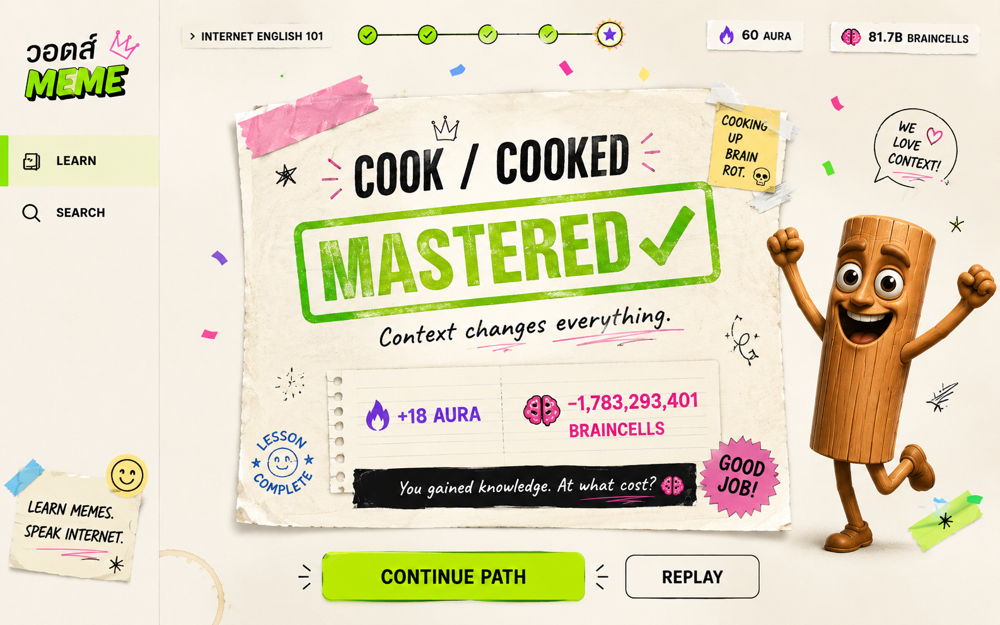

## Search Input

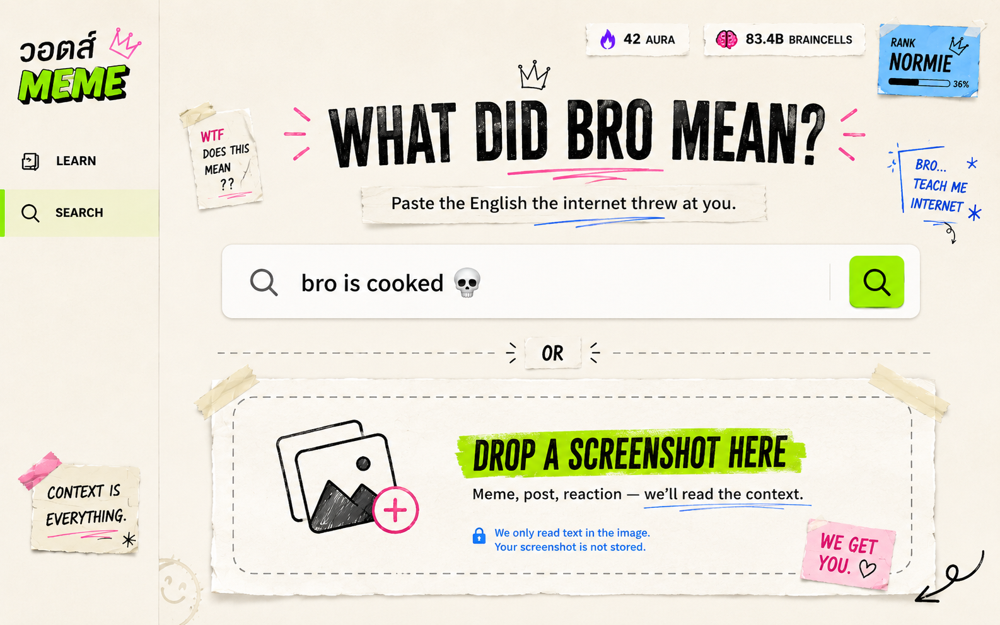

## Structured Search Result

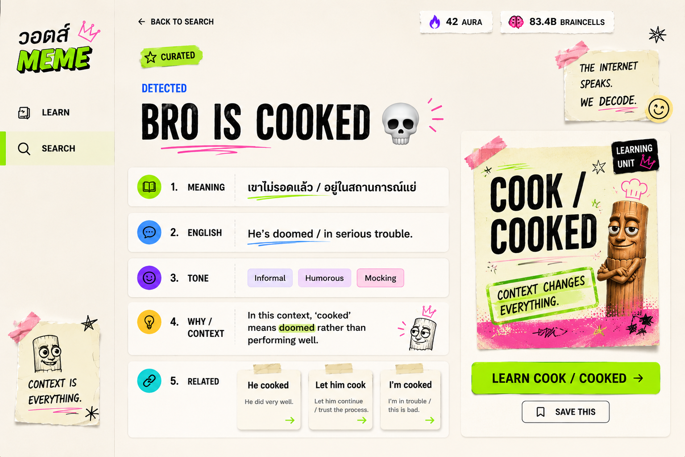

## Rank Up

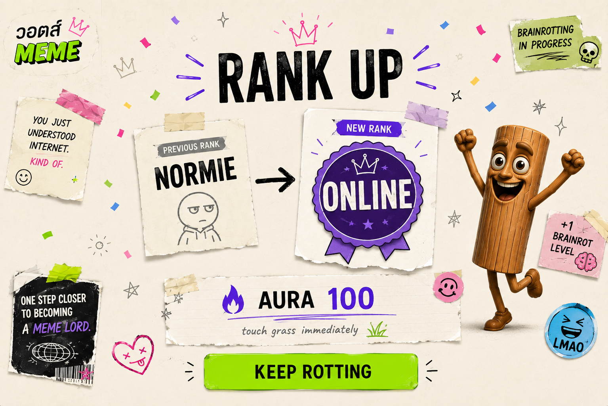

# Appendix B. Mermaid Source Pack

Copy/paste these diagrams into Mermaid Live Editor, GitHub Markdown, Notion (if supported) or project docs.

## B1 Product / System Overview

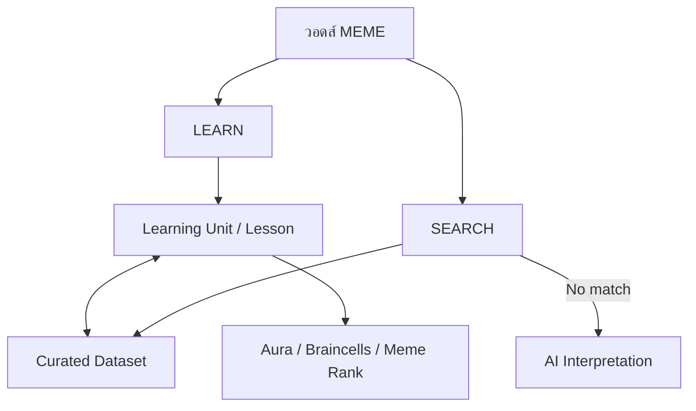
```mermaid
flowchart TD
P[วอดส์ MEME] --> L[LEARN]
P --> S[SEARCH]
L --> U[Learning Unit / Lesson]
U <--> D[Curated Dataset]
S --> D
S -->|No match| A[AI Interpretation]
U --> G[Aura / Braincells / Meme Rank]
```

## B2 Information Architecture

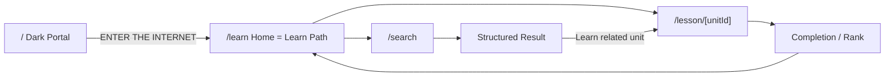
```mermaid
flowchart LR
A["/ Dark Portal"] -->|ENTER THE INTERNET| B["/learn Home = Learn Path"]
B --> C["/lesson/[unitId]"]
C --> D[Completion / Rank]
D --> B
B --> E["/search"]
E --> F[Structured Result]
F -->|Learn related unit| C
```

## B3 Learning Flow

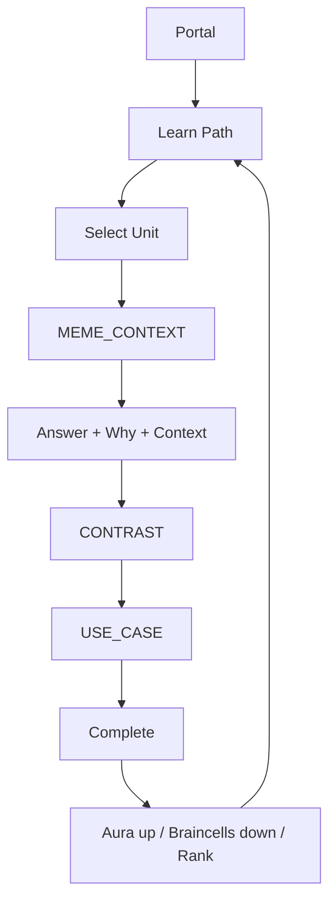
```mermaid
flowchart TD
A[Portal] --> B[Learn Path] --> C[Select Unit]
C --> D[MEME_CONTEXT]
D --> E[Answer + Why + Context]
E --> F[CONTRAST]
F --> G[USE_CASE]
G --> H[Complete]
H --> I[Aura up / Braincells down / Rank]
I --> B
```

## B4 Search Flow

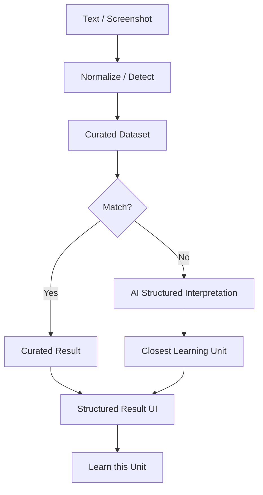
```mermaid
flowchart TD
Q[Text / Screenshot] --> N[Normalize / Detect]
N --> D[Curated Dataset]
D --> M{Match?}
M -->|Yes| C[Curated Result]
M -->|No| A[AI Structured Interpretation]
A --> R[Closest Learning Unit]
C --> U[Structured Result UI]
R --> U
U --> L[Learn this Unit]
```

## B5 Data Model

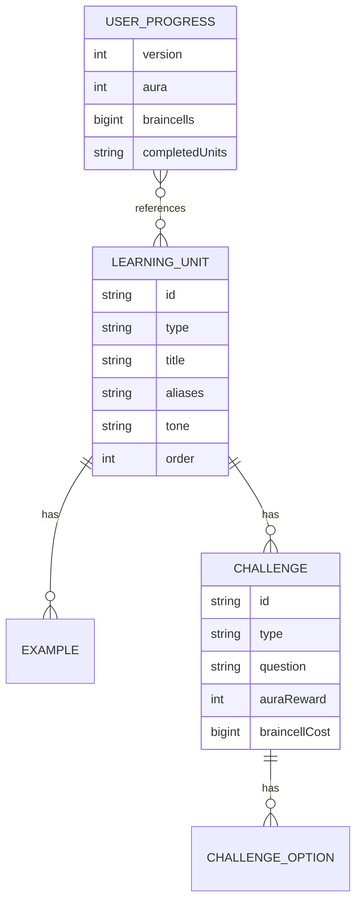
```mermaid
erDiagram
LEARNING_UNIT ||--o{ EXAMPLE : has
LEARNING_UNIT ||--o{ CHALLENGE : has
CHALLENGE ||--o{ CHALLENGE_OPTION : has
USER_PROGRESS }o--o{ LEARNING_UNIT : references

LEARNING_UNIT {
string id
string type
string title
string aliases
string tone
int order
}
CHALLENGE {
string id
string type
string question
int auraReward
bigint braincellCost
}
USER_PROGRESS {
int version
int aura
bigint braincells
string completedUnits
}
```

## B6 Runtime Architecture

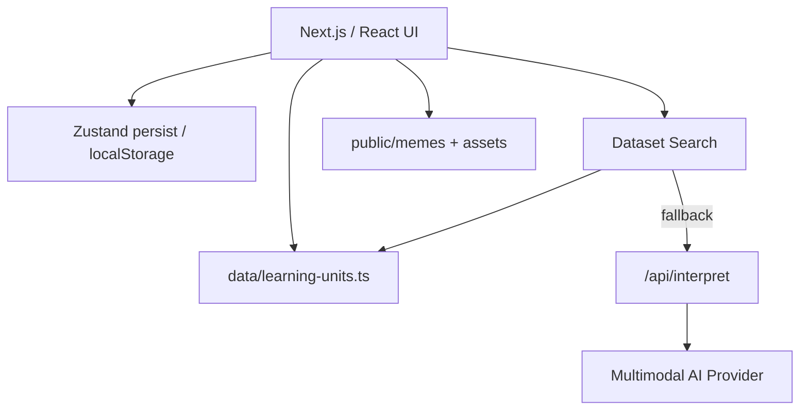
```mermaid
flowchart TD
UI[Next.js / React UI] --> DATA[data/learning-units.ts]
UI --> STORE[Zustand persist / localStorage]
UI --> SEARCH[Dataset Search]
SEARCH --> DATA
SEARCH -->|fallback| API["/api/interpret"]
API --> AI[Multimodal AI Provider]
UI --> ASSETS[public/memes + assets]
```

## B7 Lesson State Machine

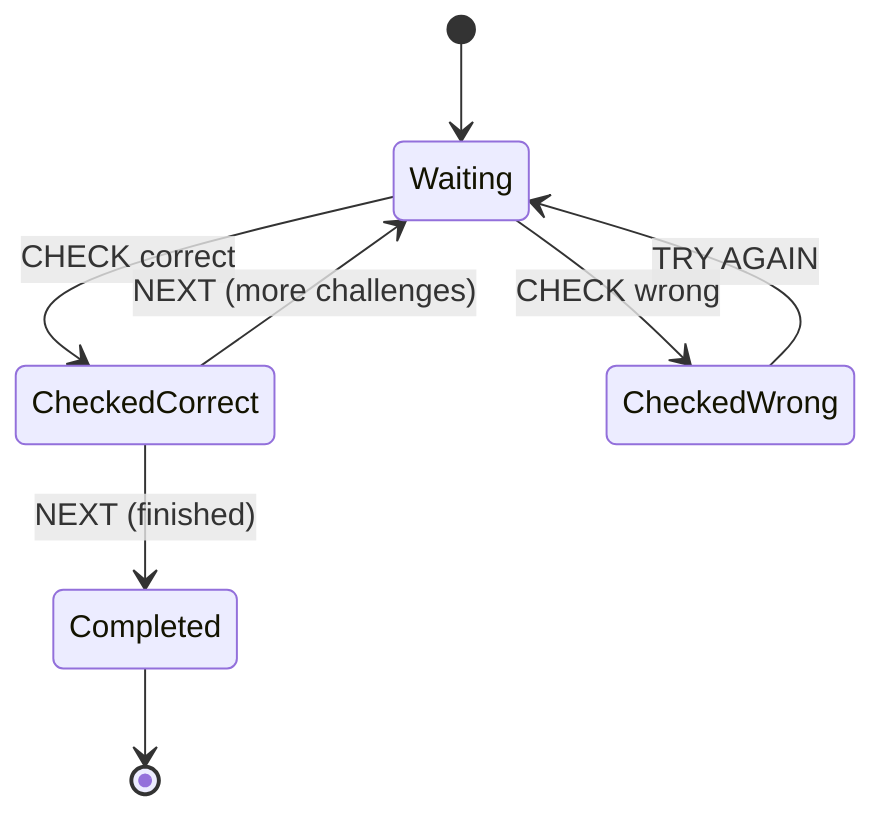
```mermaid
stateDiagram-v2
[*] --> Waiting
Waiting --> CheckedCorrect: CHECK correct
Waiting --> CheckedWrong: CHECK wrong
CheckedWrong --> Waiting: TRY AGAIN
CheckedCorrect --> Waiting: NEXT (more challenges)
CheckedCorrect --> Completed: NEXT (finished)
Completed --> [*]
```
# Appendix C. Sources & Verification

**Internal project sources**

- [P1] คัดแยกงานออกแบบ.txt: project direction / product framing.

- [P2] Branch · คัดแยกงานออกแบบ.txt: final pre-development freeze decisions.

- [P3] Canonical UI mockups generated in this project: visual direction references.

**Verified upstream technical sources (checked 16 Aug 2026)**

[G1] sanidhyy/duolingo-clone repository + README: [https://github.com/sanidhyy/duolingo-clone](https://github.com/sanidhyy/duolingo-clone)

[G2] package.json: dependency/version baseline: [https://github.com/sanidhyy/duolingo-clone/blob/main/package.json](https://github.com/sanidhyy/duolingo-clone/blob/main/package.json)

[G3] db/schema.ts: upstream course/unit/lesson/challenge schema: [https://github.com/sanidhyy/duolingo-clone/blob/main/db/schema.ts](https://github.com/sanidhyy/duolingo-clone/blob/main/db/schema.ts)

[G4] app/lesson/quiz.tsx: upstream lesson state machine: [https://github.com/sanidhyy/duolingo-clone/blob/main/app/lesson/quiz.tsx](https://github.com/sanidhyy/duolingo-clone/blob/main/app/lesson/quiz.tsx)

[G5] MIT LICENSE: [https://github.com/sanidhyy/duolingo-clone/blob/main/LICENSE](https://github.com/sanidhyy/duolingo-clone/blob/main/LICENSE)

**Optional AI implementation references (OpenAI official)**

[O1] OpenAI Developer Quickstart / Responses API / image input: [https://platform.openai.com/docs/quickstart/make-your-first-api-request](https://platform.openai.com/docs/quickstart/make-your-first-api-request)

[O2] Responses API Structured Outputs / JSON Schema reference: [https://platform.openai.com/docs/api-reference/responses-streaming/response/refusal/delta](https://platform.openai.com/docs/api-reference/responses-streaming/response/refusal/delta)

[O3] OpenAI Data Controls / endpoint retention behavior: [https://platform.openai.com/docs/models/default-usage-policies-by-endpoint](https://platform.openai.com/docs/models/default-usage-policies-by-endpoint)

*Verification note: Upstream repository versions and structure can change. This document records the state verified on 16 Aug 2026 and recommends minimizing upgrades during the hackathon.*

# Documentation Process Note

AI-assisted tools were used to help consolidate project notes, organize research, compare design alternatives, prepare prototype visual references, and draft this specification. Final product decisions, scope, content selection, UX direction, and implementation priorities were reviewed and approved by the team.

This note is included for transparency. If the hackathon has a specific AI-use disclosure policy, that event policy takes precedence over this wording.

> **START DEV CHECKPOINT:** If the team accepts this document, Product/System/Content/UX direction is frozen. Begin implementation with Phase 0 -> Phase 4 and do not reopen architecture unless a real blocker appears.
